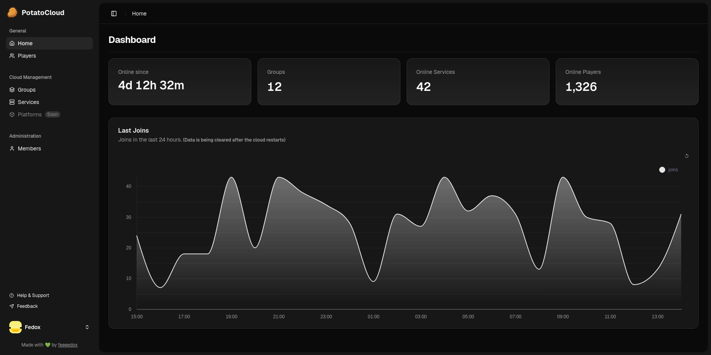

<div align="center">

# 🥔 PotatoCloud Dashboard

### Modern, Powerful, and Beautiful Dashboard for PotatoCloud

[![built with nuxt][nuxt-src]][nuxt-href]
[![vue][vue-src]][vue-href]
[![tailwindcss][tailwind-src]][tailwind-href]


**[Module](https://github.com/potatocloudmc/potatocloud)** • **[Cloud](https://github.com/potatocloudmc/potatocloud)** • **[Report Bug](https://github.com/dianprata/nuxt-shadcn-dashboard/issues)**



</div>

---

## ✨ Overview

PotatoCloud Dashboard is a **state-of-the-art, full-featured cloud management interface** built with modern web technologies. It provides a comprehensive solution for managing cloud services, players, groups, and administrative tasks with an intuitive and beautiful user interface.

Designed for performance, accessibility, and developer experience, this dashboard combines cutting-edge tools and best practices to deliver an exceptional platform.

---

## 🚀 Key Features

<table>
<tr>
<td width="50%">

### 🎨 **Modern UI/UX**
- Beautiful, responsive design with dark mode support
- Custom theme personalization with multiple color palettes
- Seamless animations and smooth transitions
- Accessibility-first approach

### 📊 **Advanced Analytics**
- Real-time dashboard statistics
- Player analytics and tracking
- Service performance monitoring
- Join statistics and insights

</td>
<td width="50%">

### 🔐 **Secure & Scalable**
- Built-in authentication system
- Role-based access control (Admin, User)
- Prisma ORM for type-safe database operations
- WebSocket support for real-time updates

### ⚡ **Developer Friendly**
- Full TypeScript support
- Composable architecture with Vue 3
- Comprehensive Prisma schema
- Hot module replacement (HMR)

</td>
</tr>
</table>

---

## 🛠️ Tech Stack

<div align="center">

| Layer | Technologies |
|-------|--------------|
| **Frontend Framework** | [Nuxt 4](https://nuxt.com/) + [Vue 3](https://vuejs.org/) |
| **Styling** | [TailwindCSS 4](https://tailwindcss.com/) + [Shadcn Vue](https://shadcn-vue.com/) |
| **Database** | [Prisma ORM](https://www.prisma.io/) |
| **Backend** | Nuxt Server Routes (Node.js) / (Javalin) |
| **Real-time** | WebSocket Integration |
| **Language** | TypeScript |
| **Package Manager** | [pnpm](https://pnpm.io/) |

</div>

---

## 📦 Installation

### Prerequisites
- **Node.js** ≥ 16.x
- **pnpm** (recommended) or npm/yarn

### Quick Start

```bash
# Clone and navigate
npx nuxi@latest init -t github:feeeedox/potatocloud-dashboard potatocloud-dashboard
cd potatocloud-dashboard

# Install dependencies
pnpm install

# Start development server
pnpm run dev
```

Your dashboard will be available at `http://localhost:3000`

---

## 🎯 Getting Started

### Development Server

```bash
# Start with hot reload
pnpm run dev

# Build for production
pnpm run build

# Start production server
pnpm run preview
```

### Project Structure

```
potatocloud-dashboard/
├── app/                          # Application root
│   ├── components/              # Reusable Vue components
│   │   ├── admin/              # Admin-specific components
│   │   ├── dashboard/          # Dashboard components
│   │   ├── settings/           # Settings interface
│   │   └── ui/                 # UI component library
│   ├── composables/            # Vue 3 composables (hooks)
│   ├── pages/                  # Route pages
│   ├── layouts/                # Layout templates
│   └── assets/                 # Static assets & styles
├── server/                       # Nuxt server routes & API
│   ├── api/                    # API endpoints
│   │   ├── auth/               # Authentication
│   │   ├── cloud/              # Cloud services
│   │   └── member/             # Member management
│   └── utils/                  # Server utilities
├── prisma/                       # Database schema
│   └── schema.prisma           # Prisma data model
└── public/                       # Public static files
```

---

## ⚙️ Configuration

### Theme & Appearance

Customize your dashboard in `app/app.config.ts`:

```typescript
export default defineAppConfig({
  appSettings: {
    sidebar: {
      collapsible: 'offcanvas', // 'offcanvas' | 'icon' | 'none'
      side: 'left', // 'left' | 'right'
      variant: 'inset', // 'sidebar' | 'floating' | 'inset'
    },
    theme: {
      color: 'default', // 'default' | 'blue' | 'green' | 'orange' | 'purple' | 'red' | 'teal' | 'yellow' | 'rose'
      type: 'scaled', // 'default' | 'mono' | 'scaled'
    }
  },
})
```

> **💡 Tip:** Clear the `app_settings` cookie after modifying configuration to see changes take effect.

### Environment Variables

Rename the `.env.example` file to `.env` and change the values.

## 🤝 Contributing

We love contributions! Here's how to get involved:

```bash
# 1. Fork the repository
# 2. Create your feature branch
git checkout -b feature/amazing-feature

# 3. Make your changes and commit
git commit -m 'Add amazing feature'

# 4. Push to the branch
git push origin feature/amazing-feature

# 5. Open a Pull Request
```

### Development Guidelines
- Write clean, maintainable code
- Follow TypeScript best practices
- Add tests for new features
- Update documentation as needed
- Use conventional commits

---

## 📄 License

This project is licensed under the **MIT License** - see the [LICENSE](LICENSE) file for details.

---

## 🙌 Support

- 🐛 [Report issues](https://github.com/feeeedox/potatocloud-dashboard/issues)
- 💬 Discuss ideas in [discussions](https://github.com/feeeedox/potatocloud-dashboard/discussions)

---

<div align="center">

**Made with ❤️ for the PotatoCloud Community**

⭐ If you find this helpful, please consider giving us a star!

</div>

[nuxt-href]: https://nuxt.com/
[nuxt-src]: https://img.shields.io/badge/Built%20With%20Nuxt-18181B?logo=nuxt.js
[tailwind-href]: https://tailwindcss.com/
[tailwind-src]: https://img.shields.io/badge/TailwindCSS-06B6D4?logo=tailwindcss&logoColor=white
[vue-href]: https://vuejs.org/
[vue-src]: https://img.shields.io/badge/Vue-4FC08D?logo=vue.js&logoColor=white
